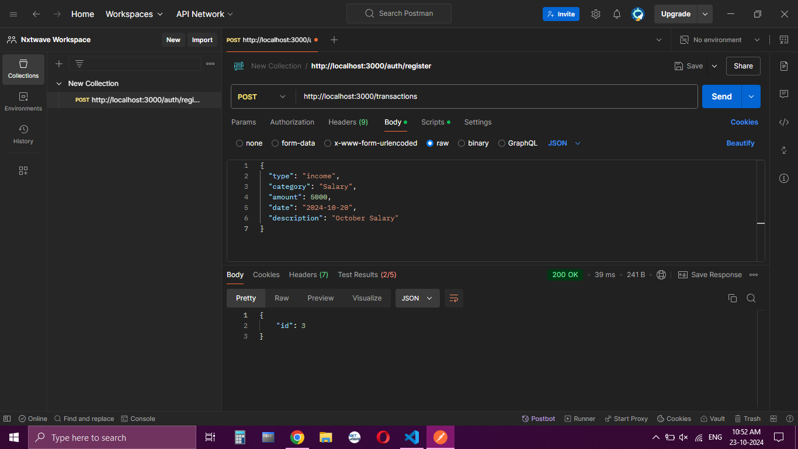
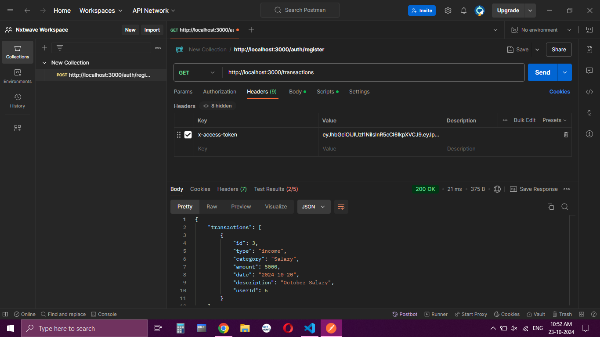
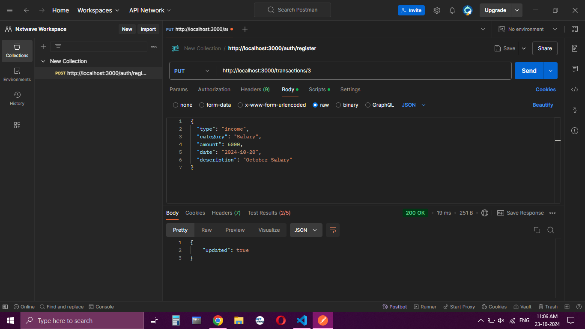
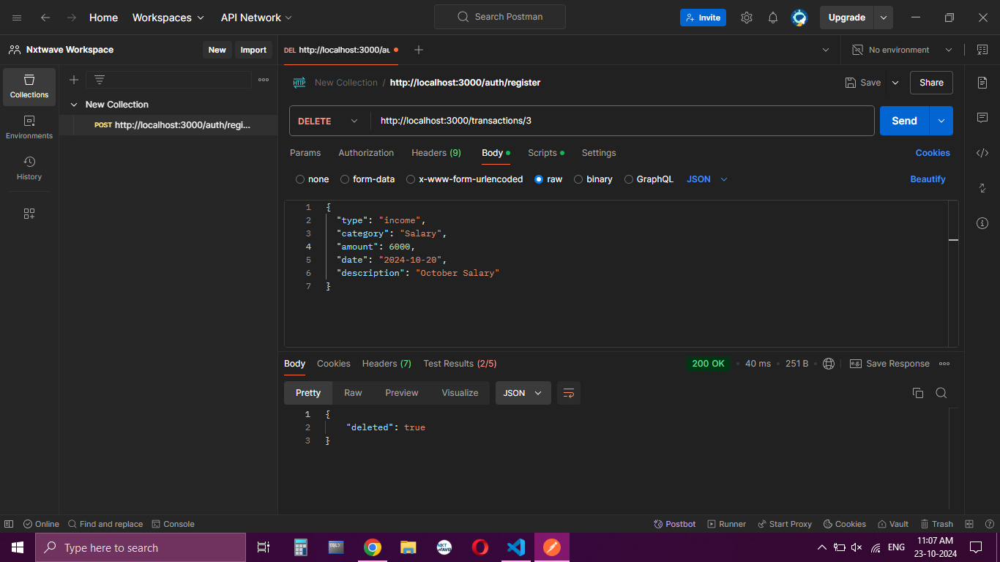
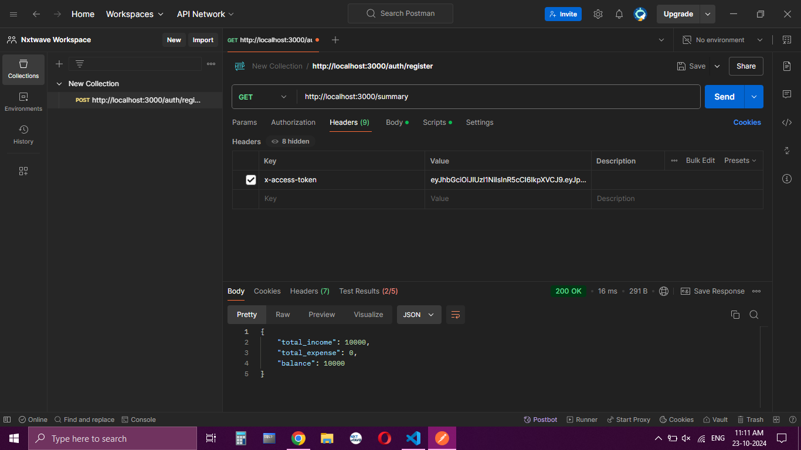

Personal Expense Tracker API

Table of Contents - [Introduction] - [Setup and Run Instructions] - [API Documentation] - [Postman Screenshots]

Introduction
This is a RESTful API for managing personal financial records, allowing users to record their income and expenses, retrieve past transactions, and get summaries by category or time period.
Setup and Run Instructions

Prerequisites

- Node.js (v14 or later)
- SQLite

Installation

1. Clone the repository:
   git clone https://github.com/PITTAJAGADEESH/expense-tracker
   cd your-repository
2. Install the dependencies:
   npm install
3. Create a `.env` file in the root directory with the following content:
   SECRET_KEY=mycode
4. Run the application:
   npx nodemon server.js
5. The API will be running on `http://localhost:3000`.
   API Documentation

Transactions

    1. POST /transactions
        Request Headers:
            x-access-token: my_token
        Request Body:
            {
            "type": "income",
            "category": "Salary",
            "amount": 5000,
            "date": "2024-10-20",
            "description": "October Salary"
            }
        Response:
            {
            "id": 2
            }

    2. GET /transactions
        Request Headers:
            x-access-token: your_token
        Response:
            {
            "transactions": [
                {
                "id": 1,
                "type": "expense",
                "category": "Food",
                "amount": 50,
                "date": "2024-10-21",
                "description": "Lunch",
                "userId": 3
                },
                {
                "id": 2,
                "type": "income",
                "category": "Salary",
                "amount": 5000,
                "date": "2024-10-20",
                "description": "October Salary",
                "userId": 3
                }
            ]
            }

    3. GET /transactions/:id
        Request Headers:
            x-access-token: your_token
        Response:
            {
            "id": 2,
            "type": "income",
            "category": "Salary",
            "amount": 5000,
            "date": "2024-10-20",
            "description": "October Salary",
            "userId": 3
            }

    4. PUT /transactions/:id
        Request Headers:
            x-access-token: your_token
        Request Body:
            {
            "type": "expense",
            "category": "Entertainment",
            "amount": 100,
            "date": "2024-10-21",
            "description": "Movie Night"
            }
            Response:
            {
            "updated": true
            }

    5. DELETE /transactions/:id
        Request Headers:
            x-access-token: your_token
        Response:
            {
            "deleted": true
            }

    6. GET /summary
        Request Headers:
            x-access-token: your_token
        Response:
            {
            "total_income": 5000,
            "total_expense": 150,
            "balance": 4850
            }

Postman Screenshots

Conclusion
This API provides a comprehensive solution for managing personal finances, enabling users to track their transactions effectively.
